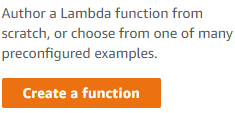
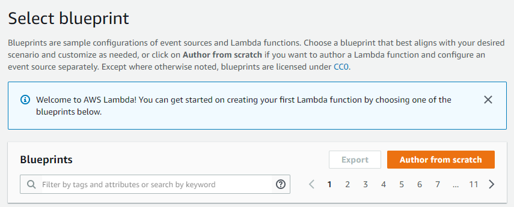
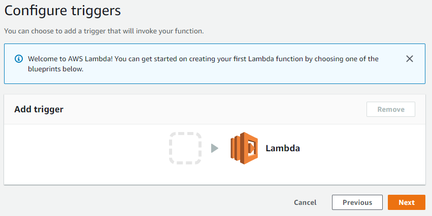
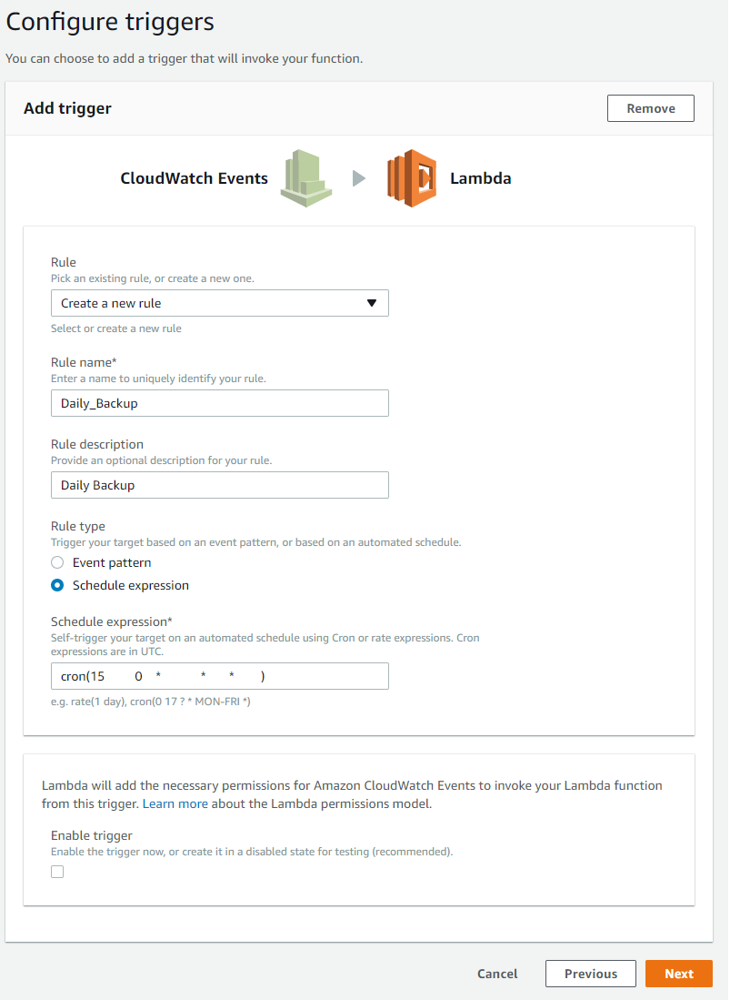
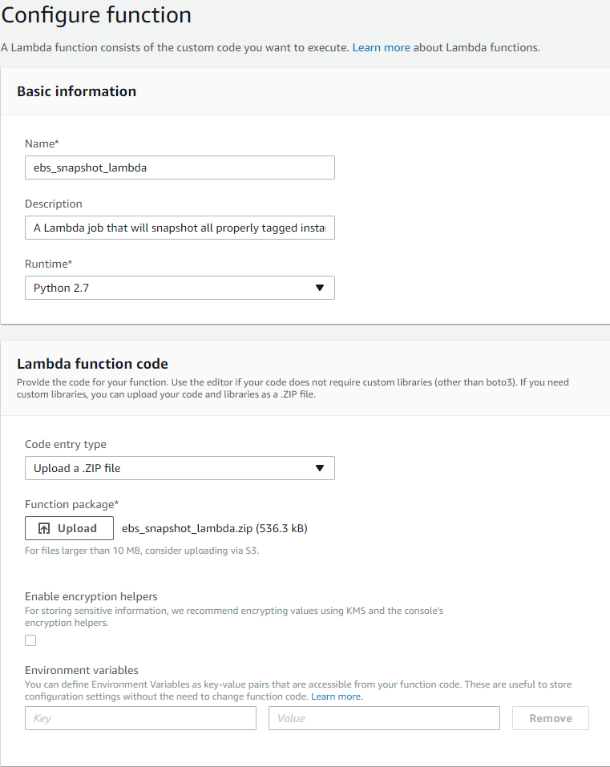
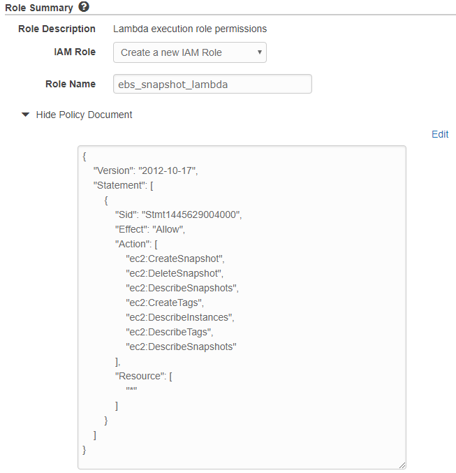
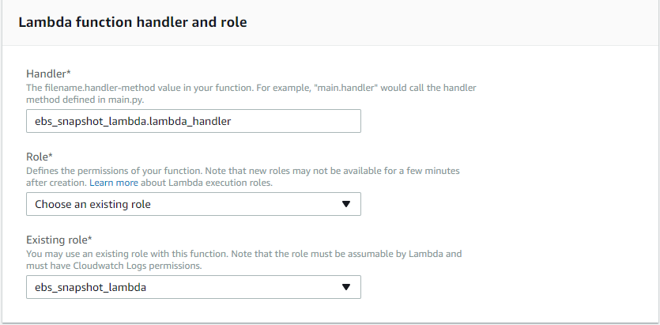
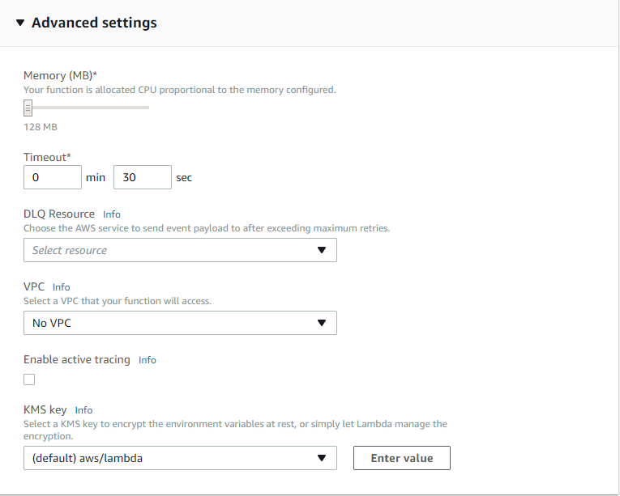
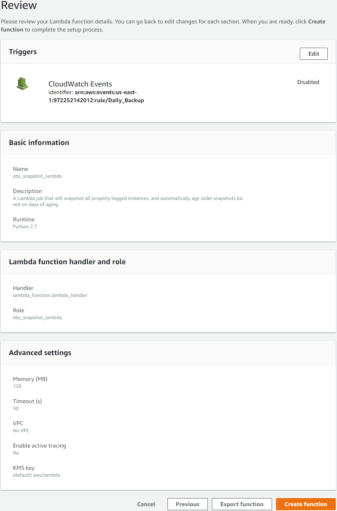

# ebs_snapshot_lambda
A Lambda job that will snapshot all properly tagged instances, and automatically age older snapshots based on days of aging.  

# Summary
Create an EBS snapshot of an EC2 instance filesystem with Lambda.  

This script is meant to run via a scheduled Lambda job.  
However, it can be run standalone, or as part of a Lambda job that is triggered by some other action than a schedule.  

# Usage
On all EC2 instances where you want the volumes to be snapped:
- Create a tag: `ebs_snapshot` 
- With the value: `yes`  
- Tag keys and values are case-sensitive  
- Tags should be applied to the EC2 instance, not the volume.  Volume tags will be ignored.  
- All volumes on the instance will be snapped.

# Installation

## Build package
Use the commandline to run `package.sh` to create the zip file assembly.  

```bash
$ ./package.sh
* Begin packaging ebs_snapshot_lambda for AWS Lambda.
* End packaging ebs_snapshot_lambda for AWS Lambda.
```

## Create a Lambda Function
Click `Create a function` in the AWS Lambda console to get started.
 
  

## Author from scratch

  

## Configure CloudWatch Events Trigger
  

## Scheduling
[AWS Lambda Developer Guide: Schedule Expressions Using Rate or Cron](http://docs.aws.amazon.com/lambda/latest/dg/tutorial-scheduled-events-schedule-expressions.html)

### Via Cron Expression
To schedule a backup via a cron-like expression entry:

```
#    minute   hour   dayOfMonth   Month   dayOfWeek
cron(15         0    *            *       *        )
```

### Via Rate Expression

```
rate(1 day)
```
### Example
  


## Lambda Function Code

  


## Lambda Policy
### Example Document Text
```json
{
    "Version": "2012-10-17",
    "Statement": [
        {
            "Sid": "Stmt1445629004000",
            "Effect": "Allow",
            "Action": [
                "ec2:CreateSnapshot",
                "ec2:DeleteSnapshot",
                "ec2:DescribeSnapshots",
                "ec2:CreateTags",
                "ec2:DescribeInstances",
                "ec2:DescribeTags",
                "ec2:DescribeSnapshots"
            ],
            "Resource": [
                "*"
            ]
        }
    ]
}
```
  

### Configure Handler and Assign New Policy

  


## Advanced Settings
You may want to increase the `Timeout` setting, based on how many snapshots you will expect to be completing.  
Since this only runs once per day, it shouldn't incur significant costs to set this fairly high if you need to.  
 
  

## Review and Create Function

  

# Limitations
There is no multi-region support.  Currently this only works in the region where the Lambda is run.
